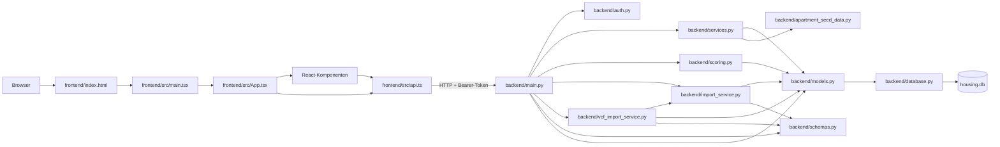
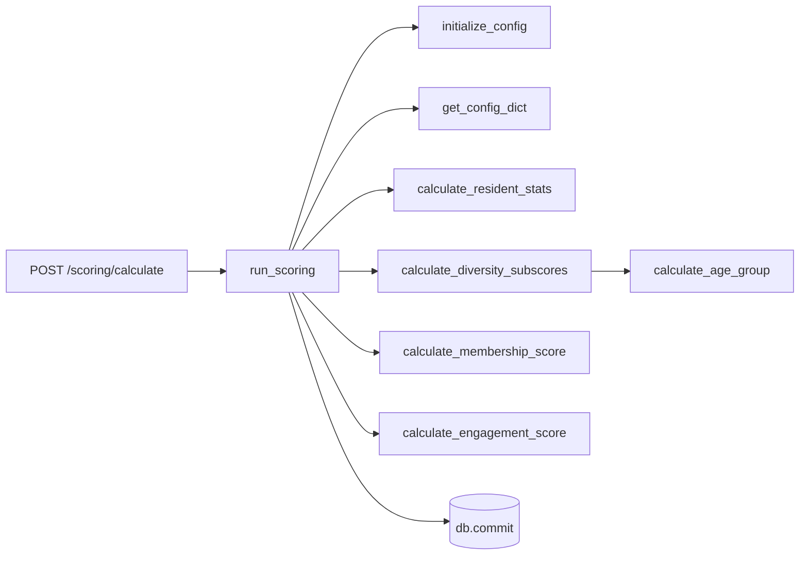
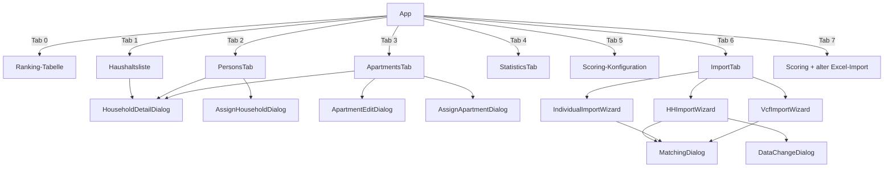

# Projektinventar

Stand: 10.09.2026. Grundlage ist eine statische Vollsicht des versionierten Bestands. Aufrufe durch FastAPI, React, SQLAlchemy und Vite werden als Framework-Aufrufe ausgewiesen. Externe Nutzer der HTTP-API sind außerhalb dieses Repositorys nicht feststellbar; solche Fälle sind mit **unklar** markiert.

Generierte bzw. ignorierte Verzeichnisse und Dateien (`.venv/`, `frontend/node_modules/`, `frontend/dist/`, `housing.db`, `tests/test_data.xlsx`, `imported_data/`) sind keine Quellmodule. `frontend/dist/` ist ein Build-Artefakt, `tests/test_data.xlsx` wird von `tests/generate_data.py` erzeugt. Die Quelle von `backend/apartment_seed_data.py` soll laut Projektdokumentation `imported_data/Wohnungen.xlsx` sein; diese Datei ist ignoriert und war nicht Teil des versionierten Bestands.

## Systemüberblick

Beim Import von `backend.main` werden Tabellen angelegt und SQLite-Schemamigrationen ausgeführt. Beim FastAPI-Startup folgen `scoring.initialize_config`, `services.seed_apartments` und `services.seed_example_data`. Im Browser hängt der Axios-Interceptor aus `frontend/src/api.ts` den Token aus `localStorage` an alle API-Aufrufe.

## Dateien auf Projektebene

| Datei | Zweck | Aufgerufen bzw. verwendet von | Ruft auf bzw. steuert |
|---|---|---|---|
| `.instructions.md` | Zentrale fachliche und technische Anforderungen. | Menschen/Entwicklungswerkzeuge; von `README.md` verlinkt. | Keine Laufzeitkomponente. |
| `CLAUDE.md` | Verweist auf `.instructions.md`. | Entwicklungswerkzeuge. | Keine Laufzeitkomponente. |
| `README.md` | Setup-, Start-, Test- und Login-Hinweise. | Menschen. | Nennt Uvicorn, npm und Testskripte. |
| `.gitignore` | Schließt Umgebung, Builds, Datenbanken, Test- und Importdaten aus Git aus. | Git. | Keine Laufzeitkomponente. |

## Backend-Module

| Modul | Zweck | Aufgerufen bzw. importiert von | Ruft auf bzw. verwendet |
|---|---|---|---|
| `backend/__init__.py` | Leerer Package-Marker für relative Imports und `backend.*`-Importe. | Python-Imports, Uvicorn und Tests implizit. | Nichts. |
| `backend/database.py` | Definiert SQLite-URL, SQLAlchemy-Engine, `SessionLocal` und deklarative `Base`. | `models.py`, `main.py`; indirekt alle DB-nutzenden Module. | SQLAlchemy. |
| `backend/auth.py` | Ein globaler zufälliger Session-Token; Passwortprüfung gegen `APP_PASSWORD`; FastAPI-Dependency `require_auth`. | `main.login`; alle geschützten Routen über `Depends(auth.require_auth)`. | `OAuth2PasswordBearer`, `secrets.compare_digest`. |
| `backend/models.py` | SQLAlchemy-ORM für `Household`, `Person`, `Apartment`, `Application`, `ScoringConfig` samt Beziehungen. | `main.py`, `services.py`, `scoring.py`, beide Importservices und DB-nahe Tests. | `database.Base`, SQLAlchemy-Spalten und Beziehungen. |
| `backend/schemas.py` | Pydantic-Verträge für CRUD, Ranking sowie Analyse-/Commit-Nachrichten der drei Importe. | `main.py`, `import_service.py`, `vcf_import_service.py`; gespiegelt durch `frontend/src/types.ts`. | Pydantic. |
| `backend/apartment_seed_data.py` | Statische Stammdaten für 136 Wohnungen sowie deren Feldreihenfolge. | `services.seed_apartments`, `tests/test_apartments.py`. | Keine weitere Projektlogik. |
| `backend/services.py` | Einfacher alter Excel-Direktimport, Wohnungs-Seed, Wohnungs-/Haushaltszuordnung und Beispieldaten. | `main.py`; `tests/test_apartments.py`. | Pandas, ORM-Modelle, `apartment_seed_data`. |
| `backend/scoring.py` | Standardgewichte/-ziele, Bewohnerstatistik, Teil-Scores und Persistierung des Gesamt-Scores. | Startup und Scoring-/Config-Routen in `main.py`. | ORM-Modelle und Pandas-Datumsrechnung. |
| `backend/import_service.py` | In-Memory-Import-Sessions; Parsen, Deduplizieren, Matching, Vorschau und Commit für Haushalts- und Individualbogen. Stellt gemeinsame Namens-/Datums-/Matching-Helfer für vCard bereit. | Fragebogenrouten in `main.py`; `vcf_import_service.py`. | Pandas, ORM-Modelle, Pydantic-Schemas. |
| `backend/vcf_import_service.py` | vCard-Decoding/Parsing, NOTE-Auswertung, Haushaltsbildung, Vorschau, Matching und Commit. Erster Schritt der Importkette: legt Personen an, Haushalte nur bei Wohnungszuordnung. | vCard-Routen in `main.py`; `tests/test_vcf_import.py`, `tests/test_import_order.py`. | Gemeinsame Helfer (u. a. `match_person_in`) und Session-Store aus `import_service.py`, ORM-Modelle, Schemas. |
| `backend/main.py` | FastAPI-Anwendung, CORS, DB-Dependency, Importzeit-Migrationen, Startup und alle HTTP-Endpunkte. | Uvicorn (`backend.main:app`), Browser über `api.ts`, Integrationstest und mögliche externe API-Clients. | Alle Backend-Module. |
| `backend/requirements.txt` | Direkte Python-Abhängigkeiten. | `pip install -r`. | FastAPI/Uvicorn, SQLAlchemy, Pydantic, Pandas/OpenPyXL und Multipart-Unterstützung. |

## Backend-Aufrufbeziehungen

### Start und Datenbank

1. Uvicorn importiert `backend.main:app`.
2. `main.py` ruft bei Modulimport `models.Base.metadata.create_all(database.engine)` auf.
3. `main.py` untersucht bestehende Tabellen und führt fehlende Spalten sowie Datenmigrationen per SQL aus.
4. FastAPI ruft `startup_event` auf.
5. `startup_event` öffnet `database.SessionLocal`, ruft `scoring.initialize_config`, `services.seed_apartments` und `services.seed_example_data` auf und schließt die Session.
6. `seed_apartments` liest `apartment_seed_data.FIELDS/APARTMENTS` und legt nur noch nicht vorhandene Wohnungsnummern an.
7. `seed_example_data` beendet sich bei einem vorhandenen Haushalt; sonst legt es Haushalte/Personen an, ruft erneut den idempotenten Wohnungs-Seed und für Bewohner `assign_household` auf und erzeugt Bewerbungen.

`get_db` wird von FastAPI für jede DB-Route als Dependency aufgerufen und liefert eine Session. `auth.require_auth` wird ebenfalls als Dependency jeder Route außer `/token` aufgerufen; dieses wiederum lässt `OAuth2PasswordBearer` den Bearer-Token lesen.

### HTTP-Endpunkte

| Methode und Pfad | Handler | Direkter Aufrufer im Repository | Wesentliche weitere Aufrufe |
|---|---|---|---|
| `POST /token` | `main.login` | `api.login`; `tests/test_flow.py` | `auth.verify_password` |
| `GET /households/` | `main.read_households` | `api.getHouseholds`; `tests/test_flow.py` | ORM-Abfrage, optional ohne archivierte Haushalte |
| `GET /households/{id}` | `main.read_household` | `api.getHousehold` | ORM-Abfrage |
| `POST /households/` | `main.create_household` | Kein Client im Repository gefunden; extern per HTTP möglich, daher Nutzung **unklar**. | Erzeugt `Household` und dessen `Person`-Datensätze |
| `PUT /households/{id}` | `main.update_household` | `api.updateHousehold` | Pydantic-Patch auf ORM-Modell |
| `GET /people/` | `main.read_all_persons` | `api.getAllPersons` | ORM-Abfrage, ergänzt `household_name` |
| `GET /people/unassigned` | `main.read_unassigned_persons` | `api.getUnassignedPersons` | ORM-Abfrage |
| `PUT /people/{id}` | `main.update_person` | `api.updatePerson` | Pydantic-Patch auf ORM-Modell |
| `POST /people/{id}/assign/{household_id}` | `main.assign_person` | `api.assignPerson` | Setzt `household_id` und `updated_at` |
| `DELETE /people/{id}/assign` | `main.unassign_person` | `api.unassignPerson` | Löscht nur die Zuordnung |
| `PATCH /households/{id}/archive` | `main.toggle_archive_household` | `api.toggleArchiveHousehold` | Schaltet Haushalt und zugehörige Personen gemeinsam um |
| `PATCH /people/{id}/archive` | `main.toggle_archive_person` | `api.toggleArchivePerson` | Schaltet einzelne Person um |
| `GET /apartments/` | `main.read_apartments` | `api.getApartments` | ORM-Abfrage, ergänzt `household_name` |
| `POST /apartments/` | `main.create_apartment` | `api.createApartment` | Erzeugt Wohnung |
| `PUT /apartments/{id}` | `main.update_apartment` | `api.updateApartment` | Pydantic-Patch auf Wohnung |
| `DELETE /apartments/{id}` | `main.delete_apartment` | `api.deleteApartment` | Löscht zuerst Bewerbungen, dann Wohnung |
| `POST /apartments/{id}/assign/{household_id}` | `main.assign_apartment` | `api.assignApartment` | `services.assign_household` |
| `DELETE /apartments/{id}/assign` | `main.unassign_apartment` | `api.unassignApartment` | `services.assign_household(..., None)` |
| `GET /applications/` | `main.read_applications` | Kein Client im Repository gefunden; extern per HTTP möglich, Nutzung **unklar**. | ORM-Abfrage |
| `POST /applications/` | `main.create_application` | Kein Client im Repository gefunden; extern per HTTP möglich, Nutzung **unklar**. | Erzeugt Bewerbung |
| `GET /ranking/` | `main.get_ranking` | `api.getRanking` | Gruppiert Apartments nach Zimmerzahl/Förderung, verbindet Bewerbungen und sortiert Haushalte nach Score |
| `POST /upload/households/` | `main.upload_households` | `api.uploadHouseholds`; `tests/test_flow.py` | `services.process_excel_upload` |
| `POST /scoring/calculate` | `main.calculate_scores` | `api.calculateScores`; `tests/test_flow.py` | `scoring.run_scoring` |
| `GET /statistics/residents` | `main.get_resident_statistics` | `api.getResidentStatistics` | `scoring.calculate_resident_statistics` |
| `GET /scoring/config` | `main.get_scoring_config` | `api.getScoringConfig` | ORM-Abfrage |
| `PUT /scoring/config` | `main.update_scoring_config` | `api.updateScoringConfig` | Aktualisiert vorhandene Config-Zeilen |
| `POST /import/household-bogen/analyze` | `main.analyze_hh_bogen` | `api.analyzeHHBogen` | `import_service.analyze_household_bogen` |
| `POST /import/household-bogen/commit` | `main.commit_hh_bogen` | `api.commitHHBogen` | `import_service.commit_household_bogen` |
| `POST /import/individual-bogen/analyze` | `main.analyze_individual_bogen` | `api.analyzeIndividualBogen` | `import_service.analyze_individual_bogen` |
| `POST /import/individual-bogen/commit` | `main.commit_individual_bogen` | `api.commitIndividualBogen` | `import_service.commit_individual_bogen` |
| `POST /import/vcf/analyze` | `main.analyze_vcf` | `api.analyzeVcf` | `vcf_import_service.analyze_vcf` |
| `POST /import/vcf/commit` | `main.commit_vcf` | `api.commitVcf` | `vcf_import_service.commit_vcf` |
| `GET /import/session/{id}` | `main.get_import_session` | Kein Client im Repository gefunden; extern per HTTP möglich, Nutzung **unklar**. | Liest `import_service.import_sessions` |
| `DELETE /import/session/{id}` | `main.delete_import_session` | Kein Client im Repository gefunden; extern per HTTP möglich, Nutzung **unklar**. | Löscht aus `import_service.import_sessions` |

### Scoring

`run_scoring` bewertet nur nicht archivierte Nicht-Bewohner. `calculate_resident_stats` erzeugt aus nicht archivierten Bewohnern die Ist-Verteilung. Pro Bewerber berechnet `calculate_diversity_subscores` Alters-, Geschlechts-, Berufs-, Bildungs-, Kultur- und Lebenslagenanteile; `calculate_membership_score` nimmt das früheste Eintrittsdatum; `calculate_engagement_score` begrenzt den Wert auf 0 bis 1. Das Ergebnis wird in `Household.total_score` gespeichert.

### Fragebogenimporte

Beide Fragebogenimporte **ergänzen ausschließlich** vorhandene Daten; angelegt wird nur über den vCard-Import (siehe unten). Datensätze ohne zuordenbares Ziel zählen als `skipped_no_match`.

`analyze_household_bogen` ruft `parse_household_bogen` auf. Der Parser prüft Absenden/Datenschutz, normalisiert Werte, zerlegt bis zu sechs Personen und ruft `_deduplicate_hh` auf. Danach ruft die Analyse pro Haushalt `match_household`, bei Bedarf `compute_data_changes`, meldet über `missing_base_data_warning`, ob überhaupt Haushalte existieren, legt eine `ImportSession` in `import_sessions` ab und liefert die Vorschau. `commit_household_bogen` liest diese Session und ruft für jede Entscheidung mit Zielhaushalt `_update_household_from_raw` auf; dieses findet Personen über `match_person_in` wieder und legt nur unbekannte Personen neu an.

`analyze_individual_bogen` folgt demselben Muster über `parse_individual_bogen`, `_deduplicate_individual` und `match_individual_to_person`; letzteres berücksichtigt auch Personen ohne Haushalt. `commit_individual_bogen` ruft für jede Entscheidung mit Zielperson `_update_person_from_individual` auf.

`match_household` und `match_individual_to_person` prüfen zuerst Mitgliedsnummer, dann Name plus Geburtsdatum und zuletzt `SequenceMatcher`-Kandidaten. `match_person_in` ist der gemeinsame Personenabgleich innerhalb einer Kandidatenliste (Mitgliedsnummer → Name → Nachname + Geburtsdatum) und wird vom Haushaltsbogen und vom vCard-Import genutzt. `_cleanup_sessions` wird vor jeder Analyse ausgeführt. Commit löscht die verwendete Session; abgebrochene Sessions bleiben bis zu einer späteren Analyse oder bis zum expliziten DELETE-Endpunkt im Speicher.

### vCard-Import

1. `analyze_vcf` ruft `parse_vcf` auf.
2. `parse_vcf` ruft `decode_vcf`, `parse_vcards` und je Karte `parse_vcard_person` auf.
3. `parse_vcards` nutzt `_unfold`, `_parse_property`, `_group_key`; `VCardProperty.value/components` nutzen `_unescape` und `_split_components`.
4. `parse_vcard_person` ruft Namens-, Datums-, Geschlechts-, Adress- und NOTE-Helfer auf. NOTE-Helfer extrahieren Eintrittsdatum, Partner, Eltern und Kinder.
5. `build_households` verbindet gleiche Wohnungsnummern und eindeutige Partnerschaften ohne Wohnungsnummer per Union-Find (`_find`, `_union`) und ruft `_build_household` auf. `_build_household` ergänzt Partner/Kinder aus Notizen.
6. `analyze_vcf` verwendet das gemeinsame `import_service.match_household`, ruft bei Treffern `compute_vcf_changes` auf, warnt vor mehrfachen Zielhaushalten und speichert eine gemeinsame `ImportSession`.
7. `commit_vcf` filtert abgewählte Personen und entscheidet je Gruppe: zugeordneter Bestandshaushalt (`action == "update"`) → `_sync_household`; sonst mit Wohnungsnummer → neuer Haushalt und `_sync_household`; ohne Wohnungsnummer → `_sync_persons` ohne Haushalt (`persons_without_household`). `_sync_persons` sucht Personen über `PersonIndex.find`, erzeugt sie mit `_new_person` oder aktualisiert sie über `_apply_person_fields`.
8. `PersonIndex` lädt den Personenbestand einmal je Commit und wird um neu angelegte Personen fortgeschrieben. Innerhalb eines Haushalts gilt der unscharfe `match_person_in`-Abgleich, global nur ein eindeutiger Treffer (`_find_global`), damit gleichnamige Personen nicht verschmolzen werden.

## Frontend-Module

### Einstieg und Infrastruktur

| Modul | Zweck | Aufgerufen bzw. importiert von | Ruft auf bzw. rendert |
|---|---|---|---|
| `frontend/index.html` | HTML-Host mit `#root`. | Browser/Vite. | Lädt `/src/main.tsx`. |
| `frontend/src/main.tsx` | React-Einstieg und MUI-Theme. | `index.html`. | Rendert `App` in `React.StrictMode`, `ThemeProvider`, `CssBaseline`. |
| `frontend/src/App.tsx` | Loginzustand, Hauptnavigation (inkl. „Punkte neu berechnen" in der Kopfzeile), Ranking, Haushaltsliste, Scoring-Konfiguration und globale Detailansicht. | `main.tsx`. | API-Funktionen sowie `HouseholdDetailDialog`, `PersonsTab`, `ApartmentsTab`, `StatisticsTab`, `ImportTab`. |
| `frontend/src/api.ts` | Axios-Client, Token-Interceptor und typisierte Funktion für jeden vom Frontend genutzten Endpunkt. | `App.tsx` und Fachkomponenten. | HTTP auf `http://127.0.0.1:8000`. |
| `frontend/src/types.ts` | TypeScript-Spiegel der API-Daten und Importentscheidungen. | `api.ts`, `App.tsx`, alle Fachkomponenten. | Keine Laufzeitaufrufe. |

### Komponenten

| Modul | Zweck | Aufgerufen bzw. gerendert von | Ruft auf bzw. rendert |
|---|---|---|---|
| `components/common/ConfirmDialog.tsx` | Wiederverwendbarer Bestätigungsdialog. | `HouseholdDetailDialog`, `PersonsTab`, zweimal `ApartmentsTab`. | Nur Callback-Props. |
| `components/common/tableStyles.ts` | Gemeinsame Zebrastreifen-Stile: Klassenvergabe je Zeile und `sx` für DataGrid und einfache `<Table>`. | `App.tsx`, `PersonsTab`, `ApartmentsTab`, `StatisticsTab`. | Keine Laufzeitaufrufe. |
| `components/household/HouseholdDetailDialog.tsx` | Lädt, zeigt und bearbeitet Haushalt und Personen; archiviert Haushalt; koordiniert Personen-Zuordnung. | `App.tsx`; zusätzlich über Links aus Personen-/Wohnungsansicht geöffnet. | `getHousehold`, `updateHousehold`, `updatePerson`, `toggleArchiveHousehold`, `unassignPerson`; rendert `PersonCard`, `AddPersonDialog`, `ConfirmDialog`. |
| `components/household/PersonCard.tsx` | Anzeige/Bearbeitung einer Person inklusive Berufs-/Bildungsoptionen. | `HouseholdDetailDialog`. | Meldet Änderungen/Entfernen über Callbacks. |
| `components/household/AddPersonDialog.tsx` | Wählt eine unzugeordnete Person für einen Haushalt. | `HouseholdDetailDialog`. | `getUnassignedPersons`, `assignPerson`. |
| `components/persons/PersonsTab.tsx` | Personenliste mit Suche, Filtern, Sortierung, Archivierung und Zuordnungsaktionen. | `App.tsx`. | `getAllPersons`, `toggleArchivePerson`, `unassignPerson`; rendert `AssignHouseholdDialog`, `ConfirmDialog`; öffnet über Callback den Haushaltsdialog. |
| `components/persons/AssignHouseholdDialog.tsx` | Wählt für eine Person einen Haushalt. | `PersonsTab`. | `getHouseholds`, `assignPerson`. |
| `components/apartments/ApartmentsTab.tsx` | Wohnungsliste mit Suche, Filtern, Sortierung, CRUD und Belegungszuordnung. | `App.tsx`. | `getApartments`, `unassignApartment`, `deleteApartment`; rendert `ApartmentEditDialog`, `AssignApartmentDialog`, `ConfirmDialog`; meldet Änderungen an `App`. |
| `components/apartments/ApartmentEditDialog.tsx` | Formular zum Anlegen/Bearbeiten einer Wohnung mit Ganzzahlprüfung für Zimmer. | `ApartmentsTab`. | `createApartment` oder `updateApartment`. |
| `components/apartments/AssignApartmentDialog.tsx` | Wählt den Bewohnerhaushalt einer Wohnung. | `ApartmentsTab`. | `getHouseholds`, `assignApartment`. |
| `components/statistics/StatisticsTab.tsx` | Ist-Statistik der aktuellen Bewohner je Merkmal, umschaltbar zwischen absoluten und relativen Zahlen, mit Zielwert und Abweichung. | `App.tsx`. | `getResidentStatistics`; rein anzeigend. |
| `components/import/ImportTab.tsx` | Drei Uploadflächen in der verbindlichen Reihenfolge (1. vCard, 2. Individualbogen, 3. Haushaltsbogen); startet Analyse und öffnet passenden Assistenten. | `App.tsx`. | `analyzeHHBogen`, `analyzeIndividualBogen`, `analyzeVcf`; rendert die drei Wizards. |
| `components/import/HHImportWizard.tsx` | Dreistufige Vorschau/Zuordnung/Commit für Haushaltsbogen. | `ImportTab`. | `commitHHBogen`; rendert `MatchingDialog` und `DataChangeDialog`. |
| `components/import/IndividualImportWizard.tsx` | Dreistufige Vorschau/Zuordnung/Commit für Individualbogen. | `ImportTab`. | `commitIndividualBogen`; rendert `MatchingDialog`. |
| `components/import/VcfImportWizard.tsx` | Dreistufige vCard-Vorschau mit Suche, Problemfilter, aufklappbaren Personen und Abwahl einzelner Personen. | `ImportTab`. | `commitVcf`; rendert `MatchingDialog`. |
| `components/import/MatchingDialog.tsx` | Gemeinsame, durchsuchbare Auswahl von Fuzzy-Kandidaten oder Neuanlage. | Alle drei Import-Wizards. | Nur Callback-Props. |
| `components/import/DataChangeDialog.tsx` | Zeigt Überschreibungen/Löschungen eines Haushaltsimports und fordert Bestätigung. | Nur `HHImportWizard`. | Nur Callback-Props. |

### Frontend-Abläufe

`App.loadData` lädt Haushalte, Ranking und Scoring-Konfiguration. Erfolgreiche Änderungen in Detail-, Wohnungs- und Importansichten laufen über `onSaved`, `onChanged` bzw. `onImportComplete` zurück zu `loadData`. `PersonsTab` verwaltet seinen eigenen Reload. Die Importanalyse geschieht schon beim Upload in `ImportTab`; die Wizards verwalten Entscheidungen lokal und senden erst beim letzten Schritt den Commit.

## Frontend-Konfiguration und Abhängigkeiten

| Datei | Zweck und Beziehung |
|---|---|
| `frontend/package.json` | Definiert `vite`, `tsc` und `vite preview`; Laufzeitpakete React, MUI/Emotion und Axios sowie zwei unten als ungenutzt markierte Pakete. |
| `frontend/package-lock.json` | npm-Lockfile Version 3; fixiert den vollständigen transitiven Abhängigkeitsgraphen. Es wird von npm ausgewertet, nicht von Anwendungscode importiert. |
| `frontend/tsconfig.json` | Strikter TypeScript-/Bundler-Modus für `src`, JSX-Transformation und Referenz auf `tsconfig.node.json`. |
| `frontend/tsconfig.node.json` | TypeScript-Projekt für `vite.config.ts`. |
| `frontend/vite.config.ts` | Aktiviert das React-Plugin, Port 3000 und einen `/api`-Proxy auf Port 8000. `api.ts` verwendet jedoch eine absolute Backend-URL und damit nicht diesen Proxy. |

Tatsächliche direkte Laufzeitnutzung im Quellcode: React/ReactDOM, MUI inklusive Icons, Emotion indirekt als MUI-Styling-Engine und Axios. Vite, TypeScript, React-Plugin und Typ-Pakete werden durch Build bzw. Compiler verwendet.

## Tests und Hilfsskripte

| Modul | Zweck | Ruft auf |
|---|---|---|
| `tests/generate_data.py` | Eigenständig gestarteter Generator für den alten Excel-Direktimport. | Pandas schreibt `tests/test_data.xlsx`. |
| `tests/test_flow.py` | Eigenständig gestarteter HTTP-Integrationstest gegen einen bereits laufenden Server. | `/token`, alten Haushaltsupload, Scoring und Haushaltsliste. |
| `tests/test_apartments.py` | Eigenständig gestartete In-Memory-Prüfungen für 136 Stammdaten, Seed-Idempotenz, Zuordnung und Beispieldaten. | `models.Base`, `services.seed_apartments`, `services.assign_household`, `services.seed_example_data`. |
| `tests/test_ranking.py` | Eigenständig gestartete In-Memory-Prüfungen für Eignung Haushalt/Wohnung und die gruppierte Rangliste. | `models.Base`, `services.is_eligible`, `services.build_ranking`, `scoring.calculate_occupancy_score`. |
| `tests/test_statistics.py` | Eigenständig gestartete In-Memory-Prüfungen der Ist-Statistik: Bezugsmenge, fehlende Angaben, Summen, Zielwerte, Haushaltsgrößen. | `models.Base`, `scoring.calculate_resident_statistics`, `scoring.calculate_resident_stats`. |
| `tests/test_vcf_import.py` | Eigenständig gestartete Parser-/Haushaltsbildungsprüfungen ohne DB. | Öffentliche Parser- und NOTE-Helfer aus `vcf_import_service.py`. |
| `tests/test_import_order.py` | Eigenständig gestartete In-Memory-Prüfungen der Importreihenfolge: vCard legt alle Personen an (Haushalt nur bei Wohnungszuordnung), Individual- und Haushaltsbogen ergänzen nur. | `models.Base`, `vcf_import_service.analyze_vcf`/`commit_vcf`, `import_service.commit_individual_bogen`/`commit_household_bogen`, `SAMPLE` aus `tests/test_vcf_import.py`. |

Die Dateien verwenden eigene `if __name__ == "__main__"`-Runner und kein pytest-Discovery-Muster als primären Aufruf. `test_flow.py` sendet `{ "username": "admin" }`, während `main.login` ausschließlich das Feld `password` liest. Ob dieser Test absichtlich einen veralteten Auth-Vertrag dokumentiert, ist **unklar**.

## Nirgends aufgerufener oder nicht konsumierter Code

### Sicher ohne weitere Referenz im Repository

- `backend/scoring.py`: `import numpy as np` wird nicht verwendet.
- `backend/services.py`: der importierte Typ `date` wird nicht verwendet; die Schleifenvariable `index` in `process_excel_upload` wird nicht verwendet.
- `backend/import_service.py`: `SUBMIT_PREFIXES` und `APARTMENT_TYPE_OPTIONS` werden definiert, aber nirgends gelesen.
- `backend/import_service.py`: `ImportSession.analysis` wird gesetzt, aber nirgends gelesen.
- `backend/vcf_import_service.py`: der Eintrag `VCF_FIELD_LABELS["name"]` kann durch `compute_vcf_changes` nicht erreicht werden, weil `name` nicht in dessen `new_values` steht.
- `backend/schemas.py`: `IndividualImportPreview.existing_data_changes` wird vom Analyzer nie gesetzt und vom `IndividualImportWizard` nicht angezeigt.
- `backend/schemas.py`/`import_service.py`: `IndividualDecision.confirm_data_removals` wird im Frontend immer mitgesendet, im Backend aber nie gelesen.
- `backend/schemas.py`/`import_service.py`: `HouseholdDecision.confirm_data_removals` wird im Frontend zur Freigabe des Buttons verwendet, im Backend-Commit selbst jedoch nicht geprüft.
- `backend/scoring.py`: `weight_occupancy` wird angelegt und im Frontend editierbar angezeigt, aber `run_scoring` berechnet keinen Belegungs-Teilscore und liest das Gewicht nicht.
- `backend/models.py`: `Application.status` wird gespeichert und ausgegeben, aber innerhalb des Repositorys weder geändert noch für Ranking/Filter ausgewertet.
- `frontend/package.json`: Für `@tanstack/react-query` und `react-router-dom` wurde kein Import im Frontend-Quellcode gefunden.
- `backend/requirements.txt`: Für `python-jose[cryptography]` und `passlib[bcrypt]` wurde kein Import im Backend oder in den Tests gefunden.

### Nur in Tests oder als nicht konsumierte Parserausgabe

- `extract_parent_names` und das erzeugte Feld `parent_names` werden im Produktionspfad nicht weiterverarbeitet oder in die Vorschau übernommen; `tests/test_vcf_import.py` prüft die Extraktion. Die Modulbeschreibung sagt, Elternbeziehungen würden als Hinweis erscheinen, eine solche Ausgabe wurde jedoch nicht gefunden.
- Das vCard-Feld `categories` wird geparst und in `tests/test_vcf_import.py` zur Faltungsprüfung gelesen, danach aber weder in Haushaltsbildung, Vorschau noch Commit verwendet.
- Das geparste vCard-Feld `uid` wird nach `parse_vcard_person` nicht weiterverwendet.

### Kein interner Client, aber extern aufrufbar

Für `POST /households/`, `GET /applications/`, `POST /applications/`, `GET /import/session/{id}` und `DELETE /import/session/{id}` gibt es keinen Aufruf aus `frontend/src` oder den Tests. Da FastAPI diese Handler als HTTP-Endpunkte registriert, sind sie nicht als toter Code einzustufen. Ob andere Clients sie nutzen, ist **unklar**.

Für die übrigen FastAPI-Handler zeigt eine reine Symbolsuche ebenfalls nur die Definition; ihr Aufrufer ist das FastAPI-Routing, nicht ein direkter Python-Aufruf. Gleiches gilt für React-Komponenten: Der vollständige Importgraph enthält für jede Datei unter `frontend/src/components` mindestens einen Aufrufer. Es wurde keine unreferenzierte Frontend-Quelldatei und kein unreferenzierter exportierter Frontend-Typ gefunden.

## Mehrfach vorhandene Logik

| Logik | Vorkommen | Einordnung |
|---|---|---|
| Demografische Klassifikation | `calculate_diversity_subscores` und `calculate_resident_stats` in `backend/scoring.py` enthalten nahezu gleiche Schleifen für Alter, Geschlecht, Beruf und Bildung. | Gleiche Normalisierung/Zählung einmal für Haushalt, einmal für Bewohnergesamtheit. |
| Personen-/Haushaltsmatching | `match_household` und `match_individual_to_person` in `backend/import_service.py`. | Beide führen Mitgliedsnummer, Name+Geburtsdatum, vertauschten Vor-/Nachnamen und Fuzzy-Matching in gleicher Reihenfolge aus; Rückgabe-IDs haben dabei unterschiedliche Bedeutung. |
| Datumsparser | `parse_date`/`parse_timestamp` in `import_service.py` sowie `parse_vcf_date`/`parse_vcf_timestamp`/`parse_german_date` in `vcf_import_service.py`. | Teilweise überlappende ISO-, Kompakt- und deutsche Datumsbehandlung. |
| Analyze-/Commit-Grundgerüst | Haushaltsbogen, Individualbogen und vCard in beiden Importservices. | Jeweils Session-Bereinigung, Parsen, Matching, Preview, `ImportSession`, Decision-Map, Zähler, Commit und Session-Löschung. |
| Personen anlegen/aktualisieren | `_create_household_from_raw`/`_update_household_from_raw`, `_create_person_from_individual`/`_update_person_from_individual` und `_new_person`/`_apply_person_fields`. | Ähnliche Feldübertragung und Datumsumwandlung mit je Importquelle leicht anderer Überschreibungsregel. |
| Wohnungsartenlisten | `backend/import_service.py`, `HouseholdDetailDialog.tsx`, `ApartmentEditDialog.tsx` und fachlich `.instructions.md`. | Gleiche vier Bewerbungsarten; Apartment-Editor ergänzt `Joker`. Die Backend-Konstante ist ungenutzt. |
| Berufs-/Bildungslabels | `backend/scoring.py`, Mappingtabellen in `backend/import_service.py`, `App.tsx` und `PersonCard.tsx`. | Dieselben Kategorien werden mehrfach mit leicht abweichendem Wortlaut gepflegt. |
| Import-Wizard-Struktur | `HHImportWizard`, `IndividualImportWizard`, `VcfImportWizard`. | Gleiche drei Schritte, Decision-State, Match-Override, Commit-/Fehlerzustand und Navigationsbuttons; `MatchingDialog` ist bereits ausgelagert. |
| Zuordnungsdialoge | `AssignHouseholdDialog` und `AssignApartmentDialog`; teilweise auch `AddPersonDialog`. | Gleicher Open-Effect, Laden, Autocomplete, selected/loading/saving/error und anschließender Assign-Aufruf. |
| Tabellen filtern/sortieren | `PersonsTab` und `ApartmentsTab`. | Lokaler Such-/Filterzustand, `useMemo`-Sortierung, `TableSortLabel` und Reload nach Mutation. |
| Datumsformatierung | `App.tsx`, `HouseholdDetailDialog.tsx`, `PersonCard.tsx`, `PersonsTab.tsx`, zusätzlich eine Variante in `VcfImportWizard.tsx`. | `toLocaleDateString('de-DE')` bzw. Datum+Uhrzeit ist mehrfach nahezu wortgleich implementiert. |
| Zuordnung lösen | Personen: `main.unassign_person`; Wohnungen: `main.unassign_apartment` plus `services.assign_household(..., None)`. | Fachlich ähnliche Soft-Unlink-Operationen, aber für verschiedene Beziehungen. |
| Alter Excel-Import vs. Assistent | `services.process_excel_upload` und Haushalts-/Individualpfade in `import_service.py`. | Beide lesen Excel und erzeugen Haushalte/Personen; der alte Pfad schreibt sofort, die neuen Pfade analysieren und committen zweistufig. Beide sind über die UI erreichbar. |

## Unklarheiten und Grenzen

- **unklar:** Ob die fünf HTTP-Endpunkte ohne Repository-internen Client von externen Werkzeugen genutzt werden.
- **unklar:** Ob die in `README.md` genannten Benutzer `admin` und `viewer` noch gelten. Der implementierte Vertrag kennt nur ein Passwort, einen globalen Token und keine Rollen oder Benutzernamen.
- **unklar:** Ob der ungenutzte Vite-Proxy für eine geplante Umstellung von der absoluten API-URL vorgesehen ist.
- **unklar:** Ob `parent_names`, `uid`, `categories`, `ImportSession.analysis` und die ungenutzten Dependencies bewusst für spätere Funktionen vorgehalten werden.
- Statische Analyse kann Aufrufe aus nicht versionierten Skripten, Browser-Lesezeichen, externen API-Clients oder dynamisch geladenem Code nicht nachweisen. Für solche Nutzung wird nicht geraten.